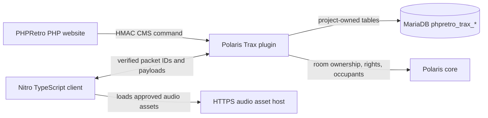

# Polaris, Nitro and Remaining-501 Implementation Plan

## Goal

Restore every intentional 501 remaining in PR #27 with modern PHP, Polaris and Nitro implementations. This includes Trax, Club purchase, room transfer, voucher redemption, group badge editing, group tags, and avatar-sticker purchase/editing.

Trax is the first detailed feature in this document. Each remaining feature receives the same source-audited implementation contract before code is written. The PHP website supplies account/admin pages and talks to Polaris through its authenticated CMS interface; it must not write live emulator state directly into Polaris tables.

## Current verified state

- `flash/traxplayer/traxplayer.swf` is a legacy Flash player and cannot run in modern browsers.
- `habblet/trax_song.php` and `habblet/myhabbo_traxplayer_select_song.php` deliberately return 501. The Phase 6 audit verified that user-composed home Trax songs and widget-selected tracks do not map to Polaris.
- Polaris has `soundtracks` and `users_soundtracks`, but those represent its own jukebox/music-disc model. They must not be presented as a drop-in replacement for the Flash home player.
- `users_settings.volume_trax` already exists and is owned by Polaris. The new client should honour it rather than add another volume setting.
- No Polaris-owned table will be altered. New persistent data, if required, is owned by this project and is prefixed `phpretro_`.

## Combined PR #27 completion scope

PR #27 intentionally leaves seven feature areas unavailable. The final combined implementation PR replaces all of them, subject to the source-audit gates below.

| PR #27 501 feature | Modern replacement | Primary work |
| --- | --- | --- |
| Trax widget, select-song endpoint, song route | Room jukebox plus modern MyHabbo display/control widget | Polaris plugin, Nitro TypeScript, PHP configuration UI |
| Club subscription purchase | Native Polaris offer purchase flow surfaced through Nitro and a safe website handoff | Polaris extension/core audit, Nitro UI, PHP handoff only |
| Group room transfer | Authorised guild-room reassignment | Polaris core change or maintained fork, Nitro room/guild refresh, PHP settings handoff |
| Website voucher redemption | Native emulator voucher redemption from a connected Nitro client | Polaris/Nitro contract, PHP handoff only |
| Flash badge editor | Nitro-compatible three-digit guild badge editor | Polaris/Nitro audit and implementation, PHP handoff only |
| Group tags | Modern website group-tag feature | PHPRetro migration/PHP; Nitro only if in-client display is approved |
| Flash avatar-sticker purchase/editor | Modern avatar-decoration feature after a source/data audit | PHP plus possible Polaris/Nitro extension; no assumed schema mapping |

No item will be restored by writing guessed columns into Polaris tables, replaying a Flash request, or using an unauthenticated website-to-emulator channel.

## Product boundary to approve before implementation

The first release is **room jukebox playback**, not a byte-for-byte recreation of old user music composition.

1. Tracks are staff-approved audio assets with fixed IDs and metadata. Users cannot upload arbitrary audio files.
2. A room needs an eligible jukebox interaction/furni before playback can be started.
3. Room owner and room-rights users can select, start, pause, stop and reorder the room playlist. Other occupants can listen and view the currently playing track.
4. Playback begins at a server timestamp, so late joiners start at the correct offset.
5. The legacy MyHabbo Trax widget remains unavailable until a separate website-home specification exists. It is a different feature from room audio.

This boundary avoids inventing a mapping between the old Flash homes schema and Polaris's in-room music model.

## PR #27 integration and delivery strategy

PR #27 (`feature/restore-remaining-501s`) is Phase Zero for this plan. It restores the project-owned MyHabbo foundation that Trax needs: layout records, the homes catalogue, website inventory, group-home support, permissions and the live-sync outbox. Its Trax handlers intentionally remain 501 because they require the Polaris/Nitro work described here.

Do not merge PR #27 and then start a separate, disconnected Trax branch. When implementation begins, create the Trax working branch from PR #27's head. That branch will contain both PR #27's completed website restorations and the new Trax work, and its final PR will target `master`. The standalone PR #27 can then be closed as superseded once the combined PR is ready for review.

The combined work adds a **modern MyHabbo Trax widget** on top of the room-jukebox feature:

1. Enable the currently blocked `traxplayerwidget` only after authoritative Polaris/Nitro playback exists.
2. Add the skipped user-home widget catalogue entry (legacy slot 108) through a new project migration. It is a modern widget, not a Flash asset.
3. Add a project-owned widget configuration record that links one MyHabbo layout widget to one verified Polaris room. The record stores configuration only; playback state remains owned by the Polaris plugin.
4. Render now-playing metadata, cover art, room status and a Join Room action on the home page. The owner/authorised room users receive controls; visitors receive display-only state.
5. Replace `myhabbo_traxplayer_select_song.php` with a signed CMS command to the plugin, including the room-state revision. It never writes Polaris state directly.
6. Replace the legacy `trax_song.php` Flash route with a modern explanatory response or Nitro room link. It does not become an unauthenticated audio-file endpoint.
7. Keep group Trax widgets out of the first release. PR #27 also skips legacy group slot 113; that is a later product decision after the user-home widget is stable.

The existing PR #27 outbox remains useful for layout/configuration changes, but it cannot synchronize real-time music. The Polaris plugin packet broadcasts remain the only authority for start, pause, track selection and late-join playback state.

## Remaining PR #27 features: required implementation work

### Club subscription purchase

The legacy website offers (one, three and six months at fixed legacy prices) do not match Polaris `catalog_club_offers`. The new feature uses verified current Polaris offer IDs, prices, currencies, subscription type, duration and rewards; it does not translate old `optionNumber` values.

1. During the source audit, identify Polaris's real catalog purchase/subscription service, offer validation, credit/points debit path and cache refresh path.
2. Add a narrowly scoped server-side purchase operation only if it uses the same atomic service as the in-game catalog. It must validate the offer from server data and debit balances and grant the subscription in one transaction.
3. Add Nitro's Club offer/purchase UI using the discovered catalog contract, including confirmation, insufficient-balance, duplicate-request and successful-refresh states.
4. Replace the website purchase endpoint with a view of current membership plus a handoff to the Nitro Club purchase flow. PHP must never directly decrement `users.credits` or create a `users_subscriptions` row for Club.
5. Test valid purchase, insufficient credits/points, forged offer ID, repeated request, disconnected user, online user cache refresh and expired/active membership display.

**Exit check:** a purchase has exactly the same balance, subscription and client refresh result as a native Polaris catalog purchase.

### Group room transfer

Polaris's current guild room relationship is not safely mutable through the existing CMS/RCON surface: the guild room property is immutable in the audited implementation and the normal guild update path does not persist a new room ID. This requires a Polaris core change or a maintained Polaris fork; it is not a PHP-only feature or a plugin-only database update.

1. Audit the exact Guild, Room, room-cache, guild-manager and packet classes in the deployed Polaris revision.
2. Implement one atomic `transferGuildRoom` service in Polaris core: validate owner/admin permission, target room ownership/eligibility, current guild state and any room occupancy restrictions; update every authoritative relation; invalidate caches; and persist or roll back as one operation.
3. Add a versioned CMS command that invokes that service, never an SQL update.
4. Add Nitro handlers/UI refresh for the guild detail and room state packets affected by the transfer. Existing occupants must receive a coherent result or a clear re-enter instruction.
5. Change the PHP group-settings screen from 501 to a signed command request with a clear status response.
6. Test same-room no-op, unauthorised caller, missing/foreign room, occupied room policy, success, rollback on failure, reconnect and emulator restart.

**Exit check:** no direct write to `guilds.room_id` is possible from PHP, and a transferred guild has one consistent room relationship after restart.

### Website voucher redemption

Polaris currently redeems vouchers through a connected game client and keeps redemption state in emulator-managed memory/cache. A PHP query against vouchers or `voucher_history` would not be equivalent and can double-grant rewards.

1. Audit the deployed voucher manager, redemption method, duplicate/reward handling, catalog refresh behavior and required `GameClient` context.
2. Add a Nitro voucher dialog that sends the code through the native or source-audited custom packet path to the emulator.
3. If a website entry point is kept, it validates only presentation input and hands the signed-in user to the Nitro dialog; it does not redeem the code itself.
4. Return explicit client results for unknown, expired, exhausted, already-redeemed and successful vouchers without exposing voucher inventory to other users.
5. Test every reward type, use limit, duplicate redemption, malformed code, reconnect and restart behavior against a real emulator-managed cache.

**Exit check:** the website never inserts into `voucher_history`, and every successful redemption is recorded and granted once by Polaris.

### Group badge editor

The legacy Flash editor uses two-digit parts while Polaris/Nitro uses a different three-digit group-badge representation. There is no safe conversion table to invent.

1. Audit the exact Polaris badge-part catalog, guild badge validation/update service, ownership checks, persistence path and emitted packets.
2. Build a Nitro TypeScript editor from the verified three-digit parts, including preview, colour/part selection, accessibility labels and server error feedback.
3. Add server-side validation that accepts only currently configured native parts and verifies guild owner/admin permission.
4. Replace `groups_actions_show_badge_editor.php` with a PHP handoff to the Nitro editor. Any website display uses the native generated badge identifier, not old SWF part strings.
5. Test invalid parts, forged guild IDs, owner/admin/member permissions, simultaneous edits, restart persistence and client refresh for all occupants.

**Exit check:** a badge made in Nitro is accepted by Polaris, survives restart and renders through the normal current client path.

### Group tags

Polaris `guilds` has no tags column. Group tags are therefore a website-owned feature and use new PHPRetro storage; they are never overloaded into user tags or a Polaris table.

1. Add a migration for `phpretro_guild_tags` with `id`, `guild_id`, `tag`, `created_by_user_id`, `created_at`, unique case-insensitive guild/tag constraint and verified foreign keys to `guilds.id` and `users.id`.
2. Define the approved tag rules after reviewing legacy behavior: normalized whitespace/case, length, character allowlist, per-guild cap, duplicates and moderation/deletion policy.
3. Replace add/list/remove 501 handlers with PDO-bound, CSRF-protected, guild owner/admin-authorised PHP endpoints.
4. Render tags in group/MyHabbo pages with output escaping and search them using bound exact/prefix matching as appropriate.
5. Keep tags website-only in the first release. If in-client display is later wanted, add a separate Polaris plugin packet and Nitro display-only UI; do not alter `guilds`.
6. Test permissions, duplicate/case variants, injection-as-data, maximum count, deleted guild cleanup and concurrent writes.

**Exit check:** group tags work on the website without modifying `guilds`, `users_settings.tags`, or any Polaris cache.

### Avatar-sticker purchase and editor

The old Flash avatar-sticker feature has no verified Polaris equivalent. It may overlap with figure rendering, profile backgrounds or an entirely separate legacy asset system. No table or protocol is selected until the old SWF, its requests and available modern assets are audited.

1. Inventory the SWF's visible sticker categories, purchase flow, request parameters, asset identifiers and whether it altered figure, profile home or client avatar state.
2. Audit Polaris user background fields, Nitro avatar rendering/decorations and the current figure-data asset pipeline for a real native mapping.
3. Make a documented choice after that audit:
   - use a verified native Polaris/Nitro decoration system; or
   - create project-owned `phpretro_avatar_decorations` and `phpretro_user_avatar_decorations` tables for a website-only feature; or
   - omit unsupported legacy behavior rather than pretending it maps.
4. Build the editor in HTML/Nitro TypeScript as appropriate, validate allowed asset IDs server-side, and make purchases atomic through the approved balance service.
5. If the feature changes in-client avatars, add a Polaris/Nitro refresh contract. If it is website-only, label it as such and do not write avatar fields used by the client.
6. Test asset authorization, price/balance edge cases, invalid IDs, duplicate purchase, rendering fallback and rollback.

**Exit check:** every purchasable decoration has a verified renderer and ownership record; no Flash asset or guessed avatar field is used.

## Target architecture

### Website responsibilities

- Provide staff-only track catalog management: title, artist, duration, cover image, audio URL and enabled state.
- Validate all input, protect writes with the existing CSRF and rank checks, and store no audio file uploads until an explicit storage design is approved.
- Provide a room-owner management page that reads room state through the plugin CMS API and sends commands through that API.
- Retire the two Trax 501 endpoints only when their replacement contracts exist. Do not make them issue direct database updates.
- Keep PHP-specific tables and migrations under `migrations/`; use PDO and bound parameters for every query.

### Polaris plugin responsibilities

- Be a separately versioned Java plugin/module against the exact Polaris revision in use.
- Register only after auditing Polaris's plugin lifecycle, room/music interfaces, packet registry and CMS command extension points. Packet numeric IDs and Java method names are discovered from the checked-out source; they are never guessed in this plan.
- Load enabled tracks and room playlists at startup, invalidate/reload them after a CMS catalog change, and keep authoritative in-memory playback state per room.
- Authorise every command from server-side room ownership/rights, never from a client-supplied user ID or room ID alone.
- Broadcast state changes to room occupants and send the current state when a user enters a room.
- Enforce one active playlist/player per room, track duration limits, enabled-track checks, and a maximum playlist length.
- Expose only narrow CMS commands such as `trax.catalog.reload`, `trax.room.state`, and `trax.room.control`. Reuse the existing PHPRetro HMAC CMS transport; do not add an unauthenticated PHP-to-emulator port.

### Nitro responsibilities

- Add a TypeScript Trax manager that receives authoritative room playback state, calculates position from `startedAt` and server time, and follows `users_settings.volume_trax`.
- Add a room-jukebox UI: now playing, playlist, progress, mute/volume, and controls only when the server marks the user authorised.
- Use Nitro's existing audio loading/playback facility after auditing it. Do not introduce a second audio engine if the client already has one.
- Load audio only over HTTPS from an allowlisted asset origin. Never accept a client-supplied audio URL.
- Handle join, leave, reconnect, pause, stop, track change, failed asset loading and clock drift without allowing local client state to become authoritative.

## Proposed project-owned schema

The exact CREATE statements are written only after the Polaris/Nitro source audit, but the data model is fixed enough to plan against:

| Table | Purpose | Minimum fields |
| --- | --- | --- |
| `phpretro_trax_tracks` | Approved playable catalog | `id`, `title`, `artist`, `duration_ms`, `audio_url`, `cover_url`, `enabled`, `created_at`, `updated_at` |
| `phpretro_trax_room_playlists` | Ordered tracks selected for one room | `id`, `room_id`, `track_id`, `position`, `added_by_user_id`, `created_at` |
| `phpretro_trax_room_state` | Durable current room state for recovery | `room_id`, `track_id`, `started_at_ms`, `paused_at_ms`, `status`, `updated_at` |
| `phpretro_trax_audit_log` | Moderation and troubleshooting history | `id`, `room_id`, `actor_user_id`, `action`, `track_id`, `created_at` |

Foreign keys target verified Polaris `rooms.id` and `users.id`. The plugin owns cache invalidation and live state; PHP never assumes a database write immediately changes an occupied room.

## Packet and API contract process

Do not assign packet headers in advance. During implementation, inspect the exact Polaris and Nitro revisions and add a short contract document containing the real headers, serializers and handlers.

The contract needs these messages conceptually:

| Direction | Message | Required data |
| --- | --- | --- |
| Nitro → Polaris | Request room Trax state | current room context only |
| Nitro → Polaris | Control playback | requested action, selected track or playlist position |
| Polaris → Nitro | Full room Trax state | room ID, status, track metadata ID, server start/pause time, playlist, actor permissions |
| Polaris → Nitro | State update | revision number plus changed state |
| PHP → Polaris | Signed CMS command | command name, validated payload, HMAC timestamp and nonce |
| Polaris → PHP | CMS response | success/failure code, state revision, safe display message |

Every mutable command carries a room-state revision. The plugin rejects stale revisions and returns the current state, preventing two controls from silently overwriting each other.

## Combined delivery order

1. **Phase Zero — PR #27 foundation:** use PR #27 as the branch base; do not duplicate its migrations or MyHabbo implementation.
2. **Phase A — complete source/asset audit:** extend the existing Trax audit to Club catalog purchase, guild-room transfer, voucher redemption, badge data, group-tag legacy behavior and avatar-sticker behavior.
3. **Phase B — safe website-owned feature:** implement group tags after the audit and migration review. This is independent of the client protocol work.
4. **Phase C — Polaris core capability:** implement and test guild-room transfer in a maintained fork if the audit confirms a plugin cannot safely own it.
5. **Phase D — Polaris/Nitro native flows:** implement Club, vouchers, badge editor and Trax in small independently testable feature slices, each with its own protocol receipt and compatibility check.
6. **Phase E — avatar-decoration decision and build:** implement only the audited native or website-owned design; omit unsupported Flash-only behavior.
7. **Phase F — PHP handoffs and combined release:** replace all seven 501 endpoints, run the entire PR #27 regression suite plus new emulator/Nitro integration tests, and open one combined PR against `master`.

## Trax delivery phases

### Phase A — source and asset audit

1. Check out the exact Polaris and Nitro repositories/commits used by the hotel.
2. Identify the Polaris plugin lifecycle, room-enter hook, room-rights checks, existing jukebox/music code, CMS command registration and packet codecs.
3. Identify Nitro's current room UI extension points, sound manager, asset pipeline and packet registration pattern.
4. Decompile the Trax SWF only for a screen/state inventory: controls, text, states, asset names and expected behaviours. Do not copy its ActionScript into production.
5. Decide the permitted audio asset source, ownership/licensing, CDN/storage provider, maximum duration/size and HTTPS domain allowlist.
6. Publish `docs/trax-contract-audit.md` with exact source revisions, verified APIs and any incompatibilities.

**Exit check:** a reviewer can see the real plugin hooks and Nitro message paths before any protocol or schema code exists.

### Phase B — database and plugin foundation

1. Add one PHPRetro migration for the four `phpretro_trax_*` tables, indexes and verified foreign keys.
2. Build the Polaris plugin repository/service layer with parameterized SQL and startup validation.
3. Implement the signed CMS commands for catalog reload and read-only room state first.
4. Add plugin unit tests using an isolated schema and tests for HMAC rejection, malformed payloads, disabled tracks and missing rooms.
5. Add an operator health endpoint/log entry that reports plugin version, catalog count and last reload time without exposing secrets.

**Exit check:** a staff-created approved track can be loaded by the plugin, and the PHP site can read the same safe catalog through the signed CMS path.

### Phase C — authoritative room playback

1. Implement plugin room-state creation, room-entry synchronisation, start, pause, stop, select and playlist reorder operations.
2. Enforce server-side room owner/rights checks and a real jukebox eligibility check found during Phase A.
3. Persist state transitions transactionally, increment the revision and broadcast only after successful persistence.
4. Add plugin integration tests for two users in one room, late join, reconnect, permission denial, stale revision and emulator restart recovery.

**Exit check:** a test client cannot change another room's music, and two occupants receive identical authoritative state.

### Phase D — Nitro TypeScript feature

1. Add packet parsers/composers using the Phase A contract.
2. Implement the Trax state manager, audio adapter, server-time position calculation and `volume_trax` integration.
3. Build the responsive room-jukebox panel using the existing Nitro component/style system.
4. Add client tests for state transitions, position calculation, paused/reconnect behaviour, stale update rejection and audio-load failure.
5. Manually verify Chrome/Edge audio autoplay behaviour; user interaction must unlock playback where the browser requires it.

**Exit check:** two browser clients in the same room see the same track and progress; an unauthorised user has no active controls.

### Phase E — PHPRetro website integration

1. Add housekeeping catalog pages and room-owner playlist pages using the existing PDO, CSRF and rank conventions.
2. Use only the signed CMS commands for live actions; database catalog CRUD triggers a plugin reload command after commit.
3. Replace the Trax 501 page with an explanatory modern room-jukebox page and a link to the Nitro client. Do not claim MyHabbo playback is restored.
4. Add web tests for authorization, CSRF, invalid URLs, disabled tracks, CMS error handling and output escaping.

**Exit check:** a staff member can manage the approved catalog and a room owner can manage their room playlist without direct Polaris writes.

### Phase F — release and operations

1. Deploy schema migration, plugin and Nitro client to staging together; incompatible versions must refuse to start with a clear error.
2. Run a multi-client staging checklist: room ownership, rights, late join, room change, reconnect, emulator restart, disabled track, failed audio, browser volume and moderator actions.
3. Add structured plugin logs/metrics for playback commands, denials, asset failures and state recovery. Do not log signed request secrets.
4. Release behind a `TRAX_ENABLED` feature flag. Keep the old Flash assets untouched until the staged rollout is accepted, then remove their live embeds in a later cleanup PR.

**Exit check:** monitoring is clean through a staged group of testers, rollback only requires disabling the feature flag, and no user data is lost.

## Explicit non-goals for the first release

- Running or embedding the SWF in production.
- Automatically converting ActionScript to TypeScript.
- Reusing `soundtracks` or `users_soundtracks` as if they represented legacy homes Trax.
- Direct PHP writes to Polaris music/room state.
- Arbitrary user audio uploads, external URLs, or client-controlled room playback.
- Rebuilding MyHabbo homes, composition tools or the Flash widget system in the same project.

## Risks to resolve before coding

1. The actual Polaris plugin API or Nitro packet layer may not expose the required room/music hooks. Phase A decides whether a small maintained fork is necessary.
2. Browser audio autoplay and timing can prevent immediate playback. The Nitro UI must include an explicit user-gesture recovery path.
3. Audio hosting/licensing and CDN bandwidth are product/operations decisions, not emulator problems.
4. The old Trax experience may rely on proprietary samples or composition data that are absent from this repository. Rebuilding the player UI cannot recreate missing audio assets or rights.
5. The website and emulator run in separate processes. Database polling is not an acceptable substitute for the signed command plus live broadcast contract.
