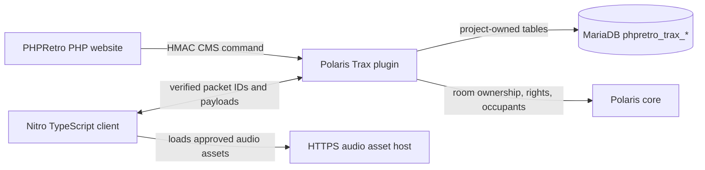

# Trax HTML5, Nitro and Polaris Implementation Plan

## Goal

Restore Trax as a modern hotel feature: people can choose approved tracks for a room jukebox, everyone in that room hears the same playback state, and room owners or authorised users control it. The legacy Flash Trax player is a visual and behavioural reference only. It will not be embedded, translated automatically, or used in production.

This is an emulator-and-client feature. The PHP website supplies account/admin pages and talks to Polaris through its authenticated CMS interface; it must not write live music state directly into Polaris tables.

## Current verified state

- `flash/traxplayer/traxplayer.swf` is a legacy Flash player and cannot run in modern browsers.
- `habblet/trax_song.php` and `habblet/myhabbo_traxplayer_select_song.php` deliberately return 501. The Phase 6 audit verified that user-composed home Trax songs and widget-selected tracks do not map to Polaris.
- Polaris has `soundtracks` and `users_soundtracks`, but those represent its own jukebox/music-disc model. They must not be presented as a drop-in replacement for the Flash home player.
- `users_settings.volume_trax` already exists and is owned by Polaris. The new client should honour it rather than add another volume setting.
- No Polaris-owned table will be altered. New persistent data, if required, is owned by this project and is prefixed `phpretro_`.

## Product boundary to approve before implementation

The first release is **room jukebox playback**, not a byte-for-byte recreation of old user music composition.

1. Tracks are staff-approved audio assets with fixed IDs and metadata. Users cannot upload arbitrary audio files.
2. A room needs an eligible jukebox interaction/furni before playback can be started.
3. Room owner and room-rights users can select, start, pause, stop and reorder the room playlist. Other occupants can listen and view the currently playing track.
4. Playback begins at a server timestamp, so late joiners start at the correct offset.
5. The legacy MyHabbo Trax widget remains unavailable until a separate website-home specification exists. It is a different feature from room audio.

This boundary avoids inventing a mapping between the old Flash homes schema and Polaris's in-room music model.

## PR #27 integration and delivery strategy

PR #27 (`feature/restore-remaining-501s`) is Phase Zero for this plan. It restores the project-owned MyHabbo foundation that Trax needs: layout records, the homes catalogue, website inventory, group-home support, permissions and the live-sync outbox. Its Trax handlers intentionally remain 501 because they require the Polaris/Nitro work described here.

Do not merge PR #27 and then start a separate, disconnected Trax branch. When implementation begins, create the Trax working branch from PR #27's head. That branch will contain both PR #27's completed website restorations and the new Trax work, and its final PR will target `master`. The standalone PR #27 can then be closed as superseded once the combined PR is ready for review.

The combined work adds a **modern MyHabbo Trax widget** on top of the room-jukebox feature:

1. Enable the currently blocked `traxplayerwidget` only after authoritative Polaris/Nitro playback exists.
2. Add the skipped user-home widget catalogue entry (legacy slot 108) through a new project migration. It is a modern widget, not a Flash asset.
3. Add a project-owned widget configuration record that links one MyHabbo layout widget to one verified Polaris room. The record stores configuration only; playback state remains owned by the Polaris plugin.
4. Render now-playing metadata, cover art, room status and a Join Room action on the home page. The owner/authorised room users receive controls; visitors receive display-only state.
5. Replace `myhabbo_traxplayer_select_song.php` with a signed CMS command to the plugin, including the room-state revision. It never writes Polaris state directly.
6. Replace the legacy `trax_song.php` Flash route with a modern explanatory response or Nitro room link. It does not become an unauthenticated audio-file endpoint.
7. Keep group Trax widgets out of the first release. PR #27 also skips legacy group slot 113; that is a later product decision after the user-home widget is stable.

The existing PR #27 outbox remains useful for layout/configuration changes, but it cannot synchronize real-time music. The Polaris plugin packet broadcasts remain the only authority for start, pause, track selection and late-join playback state.

## Target architecture

### Website responsibilities

- Provide staff-only track catalog management: title, artist, duration, cover image, audio URL and enabled state.
- Validate all input, protect writes with the existing CSRF and rank checks, and store no audio file uploads until an explicit storage design is approved.
- Provide a room-owner management page that reads room state through the plugin CMS API and sends commands through that API.
- Retire the two Trax 501 endpoints only when their replacement contracts exist. Do not make them issue direct database updates.
- Keep PHP-specific tables and migrations under `migrations/`; use PDO and bound parameters for every query.

### Polaris plugin responsibilities

- Be a separately versioned Java plugin/module against the exact Polaris revision in use.
- Register only after auditing Polaris's plugin lifecycle, room/music interfaces, packet registry and CMS command extension points. Packet numeric IDs and Java method names are discovered from the checked-out source; they are never guessed in this plan.
- Load enabled tracks and room playlists at startup, invalidate/reload them after a CMS catalog change, and keep authoritative in-memory playback state per room.
- Authorise every command from server-side room ownership/rights, never from a client-supplied user ID or room ID alone.
- Broadcast state changes to room occupants and send the current state when a user enters a room.
- Enforce one active playlist/player per room, track duration limits, enabled-track checks, and a maximum playlist length.
- Expose only narrow CMS commands such as `trax.catalog.reload`, `trax.room.state`, and `trax.room.control`. Reuse the existing PHPRetro HMAC CMS transport; do not add an unauthenticated PHP-to-emulator port.

### Nitro responsibilities

- Add a TypeScript Trax manager that receives authoritative room playback state, calculates position from `startedAt` and server time, and follows `users_settings.volume_trax`.
- Add a room-jukebox UI: now playing, playlist, progress, mute/volume, and controls only when the server marks the user authorised.
- Use Nitro's existing audio loading/playback facility after auditing it. Do not introduce a second audio engine if the client already has one.
- Load audio only over HTTPS from an allowlisted asset origin. Never accept a client-supplied audio URL.
- Handle join, leave, reconnect, pause, stop, track change, failed asset loading and clock drift without allowing local client state to become authoritative.

## Proposed project-owned schema

The exact CREATE statements are written only after the Polaris/Nitro source audit, but the data model is fixed enough to plan against:

| Table | Purpose | Minimum fields |
| --- | --- | --- |
| `phpretro_trax_tracks` | Approved playable catalog | `id`, `title`, `artist`, `duration_ms`, `audio_url`, `cover_url`, `enabled`, `created_at`, `updated_at` |
| `phpretro_trax_room_playlists` | Ordered tracks selected for one room | `id`, `room_id`, `track_id`, `position`, `added_by_user_id`, `created_at` |
| `phpretro_trax_room_state` | Durable current room state for recovery | `room_id`, `track_id`, `started_at_ms`, `paused_at_ms`, `status`, `updated_at` |
| `phpretro_trax_audit_log` | Moderation and troubleshooting history | `id`, `room_id`, `actor_user_id`, `action`, `track_id`, `created_at` |

Foreign keys target verified Polaris `rooms.id` and `users.id`. The plugin owns cache invalidation and live state; PHP never assumes a database write immediately changes an occupied room.

## Packet and API contract process

Do not assign packet headers in advance. During implementation, inspect the exact Polaris and Nitro revisions and add a short contract document containing the real headers, serializers and handlers.

The contract needs these messages conceptually:

| Direction | Message | Required data |
| --- | --- | --- |
| Nitro → Polaris | Request room Trax state | current room context only |
| Nitro → Polaris | Control playback | requested action, selected track or playlist position |
| Polaris → Nitro | Full room Trax state | room ID, status, track metadata ID, server start/pause time, playlist, actor permissions |
| Polaris → Nitro | State update | revision number plus changed state |
| PHP → Polaris | Signed CMS command | command name, validated payload, HMAC timestamp and nonce |
| Polaris → PHP | CMS response | success/failure code, state revision, safe display message |

Every mutable command carries a room-state revision. The plugin rejects stale revisions and returns the current state, preventing two controls from silently overwriting each other.

## Delivery phases

### Phase A — source and asset audit

1. Check out the exact Polaris and Nitro repositories/commits used by the hotel.
2. Identify the Polaris plugin lifecycle, room-enter hook, room-rights checks, existing jukebox/music code, CMS command registration and packet codecs.
3. Identify Nitro's current room UI extension points, sound manager, asset pipeline and packet registration pattern.
4. Decompile the Trax SWF only for a screen/state inventory: controls, text, states, asset names and expected behaviours. Do not copy its ActionScript into production.
5. Decide the permitted audio asset source, ownership/licensing, CDN/storage provider, maximum duration/size and HTTPS domain allowlist.
6. Publish `docs/trax-contract-audit.md` with exact source revisions, verified APIs and any incompatibilities.

**Exit check:** a reviewer can see the real plugin hooks and Nitro message paths before any protocol or schema code exists.

### Phase B — database and plugin foundation

1. Add one PHPRetro migration for the four `phpretro_trax_*` tables, indexes and verified foreign keys.
2. Build the Polaris plugin repository/service layer with parameterized SQL and startup validation.
3. Implement the signed CMS commands for catalog reload and read-only room state first.
4. Add plugin unit tests using an isolated schema and tests for HMAC rejection, malformed payloads, disabled tracks and missing rooms.
5. Add an operator health endpoint/log entry that reports plugin version, catalog count and last reload time without exposing secrets.

**Exit check:** a staff-created approved track can be loaded by the plugin, and the PHP site can read the same safe catalog through the signed CMS path.

### Phase C — authoritative room playback

1. Implement plugin room-state creation, room-entry synchronisation, start, pause, stop, select and playlist reorder operations.
2. Enforce server-side room owner/rights checks and a real jukebox eligibility check found during Phase A.
3. Persist state transitions transactionally, increment the revision and broadcast only after successful persistence.
4. Add plugin integration tests for two users in one room, late join, reconnect, permission denial, stale revision and emulator restart recovery.

**Exit check:** a test client cannot change another room's music, and two occupants receive identical authoritative state.

### Phase D — Nitro TypeScript feature

1. Add packet parsers/composers using the Phase A contract.
2. Implement the Trax state manager, audio adapter, server-time position calculation and `volume_trax` integration.
3. Build the responsive room-jukebox panel using the existing Nitro component/style system.
4. Add client tests for state transitions, position calculation, paused/reconnect behaviour, stale update rejection and audio-load failure.
5. Manually verify Chrome/Edge audio autoplay behaviour; user interaction must unlock playback where the browser requires it.

**Exit check:** two browser clients in the same room see the same track and progress; an unauthorised user has no active controls.

### Phase E — PHPRetro website integration

1. Add housekeeping catalog pages and room-owner playlist pages using the existing PDO, CSRF and rank conventions.
2. Use only the signed CMS commands for live actions; database catalog CRUD triggers a plugin reload command after commit.
3. Replace the Trax 501 page with an explanatory modern room-jukebox page and a link to the Nitro client. Do not claim MyHabbo playback is restored.
4. Add web tests for authorization, CSRF, invalid URLs, disabled tracks, CMS error handling and output escaping.

**Exit check:** a staff member can manage the approved catalog and a room owner can manage their room playlist without direct Polaris writes.

### Phase F — release and operations

1. Deploy schema migration, plugin and Nitro client to staging together; incompatible versions must refuse to start with a clear error.
2. Run a multi-client staging checklist: room ownership, rights, late join, room change, reconnect, emulator restart, disabled track, failed audio, browser volume and moderator actions.
3. Add structured plugin logs/metrics for playback commands, denials, asset failures and state recovery. Do not log signed request secrets.
4. Release behind a `TRAX_ENABLED` feature flag. Keep the old Flash assets untouched until the staged rollout is accepted, then remove their live embeds in a later cleanup PR.

**Exit check:** monitoring is clean through a staged group of testers, rollback only requires disabling the feature flag, and no user data is lost.

## Explicit non-goals for the first release

- Running or embedding the SWF in production.
- Automatically converting ActionScript to TypeScript.
- Reusing `soundtracks` or `users_soundtracks` as if they represented legacy homes Trax.
- Direct PHP writes to Polaris music/room state.
- Arbitrary user audio uploads, external URLs, or client-controlled room playback.
- Rebuilding MyHabbo homes, composition tools or the Flash widget system in the same project.

## Risks to resolve before coding

1. The actual Polaris plugin API or Nitro packet layer may not expose the required room/music hooks. Phase A decides whether a small maintained fork is necessary.
2. Browser audio autoplay and timing can prevent immediate playback. The Nitro UI must include an explicit user-gesture recovery path.
3. Audio hosting/licensing and CDN bandwidth are product/operations decisions, not emulator problems.
4. The old Trax experience may rely on proprietary samples or composition data that are absent from this repository. Rebuilding the player UI cannot recreate missing audio assets or rights.
5. The website and emulator run in separate processes. Database polling is not an acceptable substitute for the signed command plus live broadcast contract.
