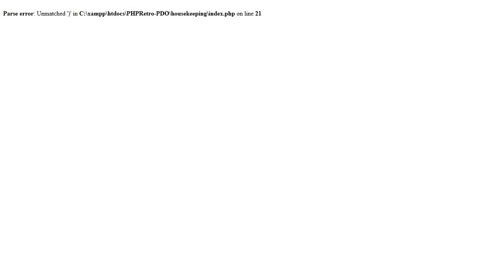
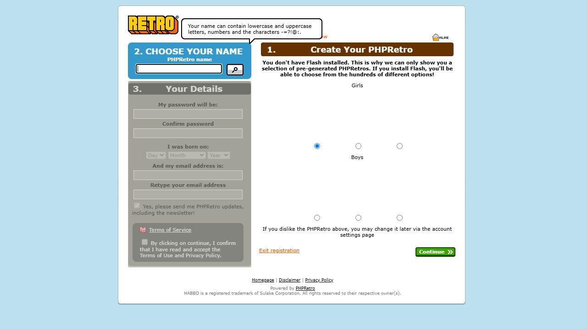

# Live XAMPP feature audit — 2026-09-15

## Result

**The site is not ready for normal member or staff use.** Public pages and several public handlers work, but normal login cannot persist a session and housekeeping cannot parse. These two blockers prevent an honest end-to-end test of the member and staff features behind them.

This PR records findings and reproducible follow-up work. It does not change application code, merge feature branches, or disable authentication to get a passing result.

Tested deployment: `C:\xampp\htdocs\PHPRetro-PDO`, Apache at `http://127.0.0.1/PHPRetro-PDO/`, PHP **8.5.10**, MariaDB database `phpretro`. Exact deployed commit: **`1c1a98c02f441450f27c4f2356a7addc237f7450`**, after PR #32. All seven tracked migrations were recorded as applied. Findings apply to this commit and configuration, not to an unmerged restoration branch.

Methods: real browser navigation/form interaction; real Apache HTTP requests with cookies, actual CSRF tokens and form-encoded data; database checks of only QA records/configuration; and PHP lint. Authenticated unit-test fixtures are **not** counted as live feature passes.

The user authorized temporary QA accounts and cleanup. One account was created as a fixture to isolate login, and a second through the real registration handler. Only test records were modified. Both accounts, the fixture settings row, one Help Tool ticket, and its outbox event were removed; cleanup queries returned zero remaining QA accounts, tickets and outbox events. No existing user's password, rank, money, content or settings was changed. No real mailbox received a test message.

## Confirmed failures and required fixes

### F1 — P1: members cannot sign in

**Reproduction:** open `/`, sign in using a valid account with the page's CSRF token, and follow the redirect. Both browser submission and a separate cookie-preserving HTTP client were tested.

- `POST /account/submit` returns **302** toward `/PHPRetro-PDO/security_check`, but its response body contains `Fatal error: Uncaught Exception: Serialization of 'PDO' is not allowed` at session shutdown.
- `GET /security_check` then returns **302** to the homepage. The browser ends back at the sign-in form. `/me` does not become accessible.
- A wrong-password submission also produces the serialization fatal, so failed-login handling is affected too.

**Cause:** [account.php](../../account.php) puts a `HoloUser` object in `$_SESSION['user']` before checking authentication success. [HoloUser](../../includes/classes.php) contains a private `Database`, which contains a PDO connection; the object has no serialization handling. PHP cannot serialize PDO.

**Required:** store safe session identity data after successful authentication, and reconstruct database access per request (or implement deliberate serialization that excludes the connection). Check the staff and remember-me variants too. Do not solve this by bypassing authentication or suppressing the exception.

**Acceptance:** correct credentials reach `/me` and remain authenticated on the next request; wrong credentials show an error without a fatal or authenticated session; logout ends the session; remember-me is tested separately.

### F2 — P1: housekeeping login and 26 other admin files cannot parse

**Reproduction:** open `/housekeeping/` or `/housekeeping/dashboard`. The browser displays `Parse error: Unmatched ')'`. The server misleadingly responds **HTTP 200**.

The malformed form is `require_once __DIR__ . '/../includes/core.php');` — a closing parenthesis remains after the opening parenthesis was removed. PHP lint of **297 PHP files outside `references/` found 27 failures**, all in housekeeping; 270 passed. This includes the changes delivered by PR #32, despite that PR's stated runtime-fix purpose.

Affected files and first failing lines:

| File under `housekeeping/` | Line |
| --- | ---: |
| about.php | 23 |
| alerts.php | 6 |
| auditlog.php | 2 |
| banners.php | 5 |
| bans.php | 5 |
| cache.php | 21 |
| campaigns.php | 5 |
| catalogue.php | 5 |
| collectables.php | 5 |
| dashboard.php | 2 |
| faq.php | 3 |
| help.php | 5 |
| index.php | 21 |
| logout.php | 20 |
| logs.php | 5 |
| maintenance.php | 2 |
| news.php | 5 |
| newsletter.php | 21 |
| recommended.php | 5 |
| reports.php | 2 |
| search.php | 2 |
| settings.php | 5 |
| staffsessions.php | 2 |
| twofactor.php | 2 |
| updates.php | 3 |
| users.php | 9 |
| vouchers.php | 5 |

**Required:** correct all malformed includes, not just the first one reported in each file. Rerun full lint before testing staff login, 2FA, permissions and individual operations. Preserve their authorization checks.

**Acceptance:** zero lint errors and an actual working staff login/2FA flow, followed by isolated QA tests of bans, content and settings administration. Merely getting HTTP 200 is not acceptance.

### F3 — P1: CAPTCHA image generation crashes

**Reproduction:** `GET /captcha.jpg` returns HTML containing `DivisionByZeroError: Division by zero` in [captcha/php-captcha.inc.php](../../captcha/php-captcha.inc.php), line 113, instead of an image. Status is again **200**.

**Cause:** `PhpCaptcha` retains a PHP 4-style constructor named `PhpCaptcha()`, so PHP 8.5 does not initialize it on `new PhpCaptcha(...)`. `captcha.php` calls `SetWidth()` before `SetNumChars()`; `CalculateSpacing()` divides by the uninitialized character count.

**Required:** initialize the object correctly and test image generation, reload and verification on PHP 8.5. The live registration POST currently succeeds without a CAPTCHA challenge; this audit does **not** claim CAPTCHA enforcement passed, or that the CAPTCHA crash prevented the tested registration POST.

**Acceptance:** valid image bytes/content type, a generated challenge, successful verification of the correct response, and rejection of incorrect/expired responses wherever a challenge is required.

### F4 — P2: registration avatar previews are blank

**Reproduction:** open `/register`. The six girl/boy selections show blank spaces. DOM inspection shows each `background-image: url(...)` contains PHP warning HTML: `Undefined variable $URL` in [includes/classes.php](../../includes/classes.php), line 356.

**Cause in this deployment:** `site_cache_images` is absent from `phpretro_site_settings`; `HoloSettings::find()` returns an empty string. Neither the `"1"` nor the `"0"` branch in `avatarURL()` assigns `$URL`. This is a configuration/default handling defect, not evidence that an external image service is down.

**Required:** define and validate image configuration/defaults, always return a valid fallback, and verify the resulting renderer URL actually supplies an image. Preserve the existing design. External avatar-service compatibility remains untested.

**Acceptance:** all six previews render, selection still submits the chosen figure, and no warning HTML appears in CSS attributes.

### F5 — P2: registration creates an account with incomplete website-ready defaults

The valid registration POST returned **302** to `/` and inserted a correctly hashed password and `mail_verified = '1'` under the current configuration. Database verification also found:

- **credits = 0**. `register_start_credits` is missing locally and the handler explicitly casts the empty setting to zero, overriding the native schema's 2,500 default. The intended configured starting balance must be decided; this report does not invent a new price/balance policy.
- **No `users_settings` row** for the new account. Several website features depend on that row. End-to-end consequences could not be reached because F1 blocks login. Polaris may initialize settings on first game login; that contract still needs verification.
- `email_verify_enabled` is missing, so the handler follows the auto-verified branch. Email delivery and token verification were not exercised.

**Required:** establish the intended signup defaults and Polaris-owned settings initialization contract. Do not invent settings values or alter Polaris-owned schemas merely to make the test green. Retest a freshly registered account through website and game login, including favorites, messaging preferences and forum posting.

### F6 — P2: warning output leaks into public/restricted pages

| Route | Observed output |
| --- | --- |
| `/help` | `Undefined array key "discussion"` in `templates/community_header.php:204`; `Undefined array key "no_column3"` in `templates/community_footer.php:36` |
| `/account/password/forgot` | Duplicate `session_start()` notice from `forgot.php:24` |
| `/email` without a token | Duplicate `session_start()` notice from `email.php:24`; successful verification is not tested |
| `/me`, `/profile`, `/home/<qa-id>/id`, `/groups`, `/discussions`, `/community`, `/articles`, `/credits`, `/club`, `/tag`, `/client` as guest | Redirect to login accompanied by `Undefined array key "page"` from `includes/session.php:36` |

**Required:** initialize optional page keys and avoid starting an already-active session. Keep authentication redirects intact. Fix the underlying warnings rather than treating suppression as feature validation.

### F7 — P3: optional asset tags point at directories

The login-family pages request `/web-gallery/js/` and `/web-gallery/styles/`, both **403**. Their optional configured filenames are empty, so the page emits directory URLs. Core JS and CSS load successfully; this is not a total styling failure.

**Required:** omit empty optional asset tags or supply valid configured files. Do not enable directory listings to hide the symptom.

## Feature matrix: what was actually verified

| Feature | Live result | Scope/limit |
| --- | --- | --- |
| Homepage and Retro styling | **Pass** | Browser renders original design; main stylesheet and landing JS return 200 |
| Registration page/name availability button | **Partial** | Browser name check unlocks details; six previews fail (F4) |
| Taken/available username validation | **Pass** | Actual AJAX returns taken-name X-JSON versus `{}` for an unused name |
| Email syntax and password-length validators | **Pass** | Actual AJAX distinguishes valid/invalid samples; does not prove mailbox delivery or full password policy |
| Invalid registration | **Partial** | Handler renders validation instead of inserting; avatar warnings remain |
| Valid account creation | **Partial** | Real form-encoded POST inserts QA account and redirects; defaults need review (F5); whole browser signup-to-login journey does not pass |
| Login / failed login | **Fail** | Session serialization fatal (F1) |
| CSRF rejection | **Pass** | Missing-token POSTs to namecheck and account submit return 403; matching tokens reach their handlers |
| CAPTCHA image/reload path | **Fail** | Image endpoint crashes (F3); challenge solving was not attempted |
| Password recovery form/unknown-account rejection | **Partial** | Browser shows invalid username/email for a nonexistent QA identity; session notice remains; no recovery email sent |
| FAQ/help landing | **Partial** | Empty-FAQ page renders with two warnings; no FAQ content was seeded |
| Help Tool validation | **Pass** | Empty submission returns validation and creates no ticket |
| Help Tool submission | **Pass for website storage** | Successful confirmation, one persisted ticket and one pending outbox event; staff processing blocked by F2 |
| Disclaimer and privacy routes | **Pass for rendering** | Both return page HTML without PHP diagnostics; legal-content adequacy was not audited |
| News RSS | **Pass for empty feed** | `/articles/rss.xml` returns well-formed RSS; no populated-item rendering was tested |
| Housekeeping login/dashboard | **Fail** | Browser and HTTP confirm parse errors (F2) |
| Remaining housekeeping operations | **Blocked / parse failures** | The 27-file lint inventory identifies the affected pages; no admin mutations attempted |
| Member landing/profile editing, homes, friends, minimail, groups and discussions | **Blocked by F1** | Cannot obtain a persistent normal session; no false claim of individual CRUD failure or success |
| Game client / SSO / emulator synchronization | **Not verified** | Login is blocked; no live game session was started |
| Remember-me, logout after successful login, email verification, successful password recovery | **Not verified end to end** | Depend on working authentication and/or mail infrastructure |

The Help Tool's `PhpretroLiveSync::notifyLiveGame()` is an intentionally empty hook. The test proved an outbox row was queued, **not** that Polaris consumed it. No consumer was exercised.

## Features explicitly unavailable in this deployed source

These are **source-confirmed unavailable branches**, not 501 responses reached through a working authenticated browser session. F1 prevents that live check. Keep them separate from the runtime defects above.

| Feature | Source/condition |
| --- | --- |
| Flash group badge editing | `includes/habblet_groups_actions.php`: native badge encoding differs |
| Group room transfer | `includes/habblet_groups.php`: changed roomId is rejected |
| Group settings not representable by the old form | ADMINS-only reading, OWNER-only topic posting, LARGE_CLOSED state |
| Group homes and legacy note/sticker placement | `groups_widgets.php`, `myhabbo_noteeditor_place.php`, `myhabbo_stickie_*`, `myhabbo_sticker_*` |
| MyHabbo store/inventory/purchase | `myhabbo_store_*` handlers |
| Home ratings | `myhabbo_rating_rate.php`, `myhabbo_rating_reset_ratings.php`; `ratingwidget` is blocked |
| Guestbook privacy settings | `myhabbo_guestbook_configure.php` |
| Club subscription and reminder dismissal | `habboclub_habboclub_subscribe.php`, `habboclub_habboclub_reminder_remove.php` |
| Trax selection/playback | `myhabbo_traxplayer_select_song.php`, `trax_song.php`; `traxplayerwidget` is blocked |
| Website voucher redemption | `ajax_redeemvoucher.php` directs users to the game client |
| Group tags | `myhabbo_tag_addgrouptag.php`, `myhabbo_tag_listgrouptags.php`, `myhabbo_tag_removegrouptag.php` |
| Unsupported widget skins/types | Conditional branches in `myhabbo_widget_edit.php`, `myhabbo_widgets.php`, `myhabbo_layout_save.php` |

This list comes from the deployed commit; it is not a claim about the current merge status or behavior of any other PR.

## Fix and retest order

1. Fix all housekeeping parse errors and require PHP 8.5 lint to pass.
2. Fix normal and staff session persistence; test successful and failed login without a fixture bypass.
3. Fix CAPTCHA and registration image/default handling.
4. With two clean QA member accounts, exercise profile persistence, friend request/accept/remove, minimail send/read/trash, home widgets/guestbook, group joins/favorites/ranks, and topic/post CRUD. Verify ownership and cross-account isolation.
5. With a dedicated QA staff account, exercise 2FA, user lookup, a reversible test ban, ticket handling, content CRUD and settings controls. Restore all test state.
6. Test email delivery and game/client synchronization separately using configured test services. Do not equate a queued outbox row with a live-game update.
7. Decide which intentional 501 features belong in the release, then test their restorations on the actual merged/deployed version.

## Evidence

[HTTP response summaries](live-audit-20260915/http-results.json) contain status, redirect and PHP diagnostic excerpts only; no passwords, request bodies, cookies or CSRF tokens. Failed exploratory probes of nonexistent `/staff` and `/xml/rss.xml` are omitted: they are not product findings. The valid feed route is `/articles/rss.xml`.

[PHP lint failures](live-audit-20260915/lint-results.json) records the affected housekeeping files. Screenshots above show the browser-visible failures. HTTP status alone is insufficient here: several error pages return 200, and failed login initially returns 302.

The deployment remained on clean `master` at the tested commit. This report lives on a separate audit branch; no application fix or configuration change was deployed during testing.
